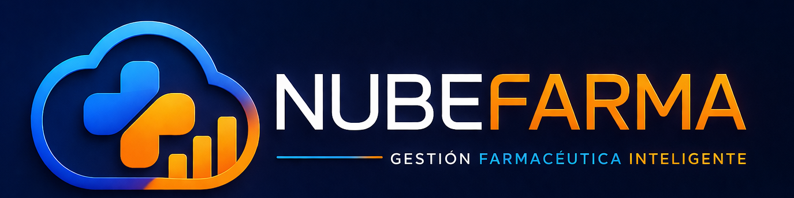

<!DOCTYPE html>
<html lang="es">
  <head>
    <meta charset="UTF-8" />
    <meta name="viewport" content="width=device-width, initial-scale=1.0" />
    <meta
      name="description"
      content="NubeFarma es una plataforma en la nube para farmacias que quieren controlar inventario, ventas, clientes y reportes en tiempo real."
    />
    <title>NubeFarma | Gestion farmaceutica inteligente</title>
    <link rel="preconnect" href="https://images.unsplash.com" />
    <link rel="stylesheet" href="styles.css" />
  </head>
  <body>
    <header class="topbar">
      

      <button class="menu-button" type="button" aria-expanded="false" aria-controls="site-menu">
        
      </button>

      <nav class="site-menu" id="site-menu" aria-label="Navegacion principal">
        <a href="index.html" data-page="index">Inicio</a>
        <a href="soluciones.html" data-page="soluciones">Soluciones</a>
        <a href="beneficios.html" data-page="beneficios">Beneficios</a>
        <a href="precios.html" data-page="precios">Precios</a>
        <a href="recursos.html" data-page="recursos">Recursos</a>
        <a href="nosotros.html" data-page="nosotros">Nosotros</a>
      </nav>

      

        <a class="btn btn-ghost" href="login.html">Acceso clientes</a>
        <a class="btn btn-orange" href="demo.html">Solicitar demo</a>
      

    </header>

    <main>
      <section class="hero">
        

        

          

            <h1>El sistema inteligente para farmacias que quieren crecer</h1>
            

              Controla inventario, facturacion, clientes, reportes y vencimientos desde un solo sistema.
              Sin instalaciones, facil de usar y con soporte local en Colombia.
            

            

              <a class="btn btn-orange btn-large" href="demo.html">Solicitar demo</a>
              <a class="btn btn-video btn-large" href="recursos.html">
                >
                Ver video
              </a>
            

            

              
N<strong>100% en la nube</strong><small>Accede desde cualquier lugar</small>

              
S<strong>Seguro y confiable</strong><small>Tus datos siempre protegidos</small>

              
R<strong>En tiempo real</strong><small>Informacion al instante</small>

            

          

          

            

              

                
                

                  <strong>Panel NubeFarma</strong>
                  <small>Operacion de hoy en tiempo real</small>
                

              

              

                <article>Ventas hoy<strong>$5.430.000</strong><small>+12% vs ayer</small></article>
                <article>Productos<strong>1.246</strong><small>Activos</small></article>
                <article>Clientes<strong>856</strong><small>Registrados</small></article>
              

              

                

                  
<strong>Ventas ultimos 7 dias</strong>Semana actual

                  
<i></i><i></i><i></i><i></i><i></i><i></i><i></i>

                

                

                  <strong>Alertas inteligentes</strong>
                  
 18 productos con stock bajo

                  
 7 lotes proximos a vencer

                  
 24 ventas pendientes de cierre

                

              

              

                InventarioVentasClientesReportes
              

            

          

        

      </section>

      <section class="solution-strip">
        

          <h2>Todo lo que tu farmacia necesita, en un solo lugar</h2>
          
        

        

          <article>
            I
            

              <h3>Inventario inteligente</h3>
              
Registra productos, lotes, fechas de vencimiento, existencias minimas y alertas de reposicion.

            

          </article>
          <article>
            F
            

              <h3>Ventas y facturacion</h3>
              
Ventas rapidas, facturacion POS, cotizaciones, devoluciones y cierre diario con trazabilidad.

            

          </article>
          <article>
            C
            

              <h3>Clientes y proveedores</h3>
              
Historial de compras, cartera, datos de contacto, proveedores y seguimiento de pedidos.

            

          </article>
          <article>
            A
            

              <h3>Reportes y analisis</h3>
              
Consulta productos mas vendidos, rotacion, utilidad, ventas por periodo y desempeno por usuario.

            

          </article>
        

      </section>

      <section class="showcase">
        

          
NUBEFARMA

          <h2>Disenado para farmacias como la tuya</h2>
          

            Tu farmacia merece mas control, mas eficiencia y mas crecimiento. NubeFarma centraliza la
            operacion diaria para que vendas mas rapido, compres mejor y sepas que esta pasando en tu negocio.
          

          <a class="btn btn-blue" href="nosotros.html">Conocer mas</a>
        

        

          

            <aside>
              
NubeFarma

              DashboardVentasProductosInventarioClientesReportes
            </aside>
            <section>
              

              
<b>$5.430.000</b><b>$162.500.000</b><b>1.246</b><b>856</b>

              
<i></i><i></i><i></i><i></i><i></i><i></i>

              

            </section>
          

        

      </section>
    </main>

    <footer class="footer">
      
&copy;  NubeFarma. Gestion farmaceutica inteligente.

      <a href="demo.html">Solicitar demo</a>
    </footer>

    
  </body>
</html>
